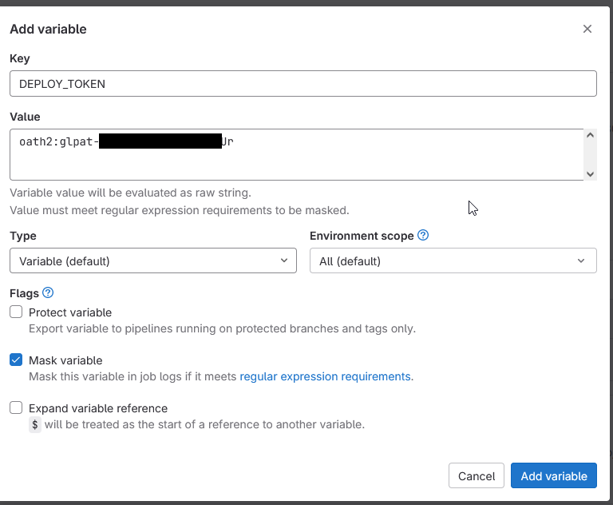

# Generating K8s Manifests with Pulumi and deploying with Gitlab CI and ArgoCD

The first question of course is: Why?

We've been using kustomize, Helm and ArgoCD to deploy services to Kubernetes pretty much since day one after we decided to move to Kubernetes. It works, it's reliable, and it's fairly easy to understand.

It is however not the newest and shiniest way to do things, and anyone who's ever worked with a developer know that they like new and shiny things.

I'm joking, of course, there are real advantages to Pulumi. The ability for developers to write code in a language they prefer instead of having to bother with Helm or plain YAML is a huge plus, and when one of our devs approached me about wanting to use Pulumi instead of having me manage their Helm charts for them, I was intrigued.

Pulumi isn't really meant to be a replacement for Helm. In fact, it works perfectly well in concert with Helm, but that doesn't mean it can't be done and the idea of no longer having to manage the Helm charts for our developers would be a big time saver for me personally. It wouldn't change anything in terms of how our actual deployments work, because those are still being handled by ArgoCD with all it's acompanying RBAC.

So I decided to just give it a try.

## Pulumi Setup

Enough talk, let's get down to business.

Setting up Pulumi is fairly straightforward, but by default it requires you to create an account and use their cloud to store state.

This wasn't really a viable option for us, because we're completely on-prem and the idea of having our deployment config in the black box of Pulumi cloud didn't sit right with me.

Luckily, Pulumi allows you to save state locally and since we really only intend to use it to generate YAML, we don't actually need to store any state. This also makes handling state in Gitlab CI a lot easier later on.

So, how do we actually get started? (I'm skipping the pulumi install here, I'm sure you can figure it out.)

```bash
PULUMI_CONFIG_PASSPHRASE=""
pulumi login --local --non-interactive
mkdir deploy && cd deploy
pulumi new kubernetes-go
PULUMI_CONFIG_PASSPHRASE="" pulumi stack init tmp --non-interactive
PULUMI_CONFIG_PASSPHRASE="" pulumi stack select tmp --non-interactive
```

This sets up a Pulumi stack. I'm using go, because it's the language I'm most familiar with, but feel free to use any language you like.

We do all this without a passphrase, because we don't want to store any state or secrets and therefore don't have anything to protect, and not having to manage a secret makes running this in Gitlab CI a lot easier.

## Deployment Code

Let's get to the actual deployment. I'm using a very basic nginx deployment for this example, but it should be pretty straight forward to adapt it to any other deployment if you familiarize yourself with Pulumi.

What we're doing in this example is creating two manifests, one for a test and one for a production cluster. This setup mimics how we would deploy a Helm chart with two different values.yaml files. In this example we really only change the name of the deployment, but if you wanted to override specific values like you would with a Helm values file you could do that by storing the values in variables and setting them for your cluster before generating the manifests with the ctx.Export() function call at the very end.

```go
package main

import (
	"github.com/pulumi/pulumi-kubernetes/sdk/v3/go/kubernetes"
	appsv1 "github.com/pulumi/pulumi-kubernetes/sdk/v4/go/kubernetes/apps/v1"
	corev1 "github.com/pulumi/pulumi-kubernetes/sdk/v4/go/kubernetes/core/v1"
	metav1 "github.com/pulumi/pulumi-kubernetes/sdk/v4/go/kubernetes/meta/v1"
	"github.com/pulumi/pulumi/sdk/v3/go/pulumi"
)

func main() {
	pulumi.Run(func(ctx *pulumi.Context) error {
		testCluster, err := kubernetes.NewProvider(ctx, "test", &kubernetes.ProviderArgs{
			RenderYamlToDirectory: pulumi.String("./deployment/test"),
		})
		if err != nil {
			return err
		}
		prodCuster, err := kubernetes.NewProvider(ctx, "prod", &kubernetes.ProviderArgs{
			RenderYamlToDirectory: pulumi.String("./deployment/prod"),
		})
		if err != nil {
			return err
		}

		appLabels := pulumi.StringMap{
			"app": pulumi.String("nginx"),
		}

		deployment := &appsv1.DeploymentArgs{
			Spec: appsv1.DeploymentSpecArgs{
				Selector: &metav1.LabelSelectorArgs{
					MatchLabels: appLabels,
				},
				Replicas: pulumi.Int(1),
				Template: &corev1.PodTemplateSpecArgs{
					Metadata: &metav1.ObjectMetaArgs{
						Labels: appLabels,
					},
					Spec: &corev1.PodSpecArgs{
						Containers: corev1.ContainerArray{
							corev1.ContainerArgs{
								Name:  pulumi.String("nginx"),
								Image: pulumi.String("nginx"),
							}},
					},
				},
			},
		}

		testDeployment, err := appsv1.NewDeployment(ctx, "test-app", deployment, pulumi.Provider(testCluster))
		if err != nil {
			return err
		}
		prodDeployment, err := appsv1.NewDeployment(ctx, "prod-app", deployment, pulumi.Provider(prodCuster))

		ctx.Export("test", testDeployment.Metadata.Name())
		ctx.Export("prod", prodDeployment.Metadata.Name())

		return nil
	})
}
```

The bit that's really important here is the Kubernetes provider.
We're using the "RenderYAMLtoDirectory" argument to tell Pulumi to render the manifests in the directory we specify.

We can run this locally with the following command:

```bash
PULUMI_CONFIG_PASSPHRASE="" pulumi up --non-interactive --skip-preview
```

The result will be two different manifest files in the directories we specified.

## Gitlab CI

So, how do we do this with Gitlab CI?

It's not actually that different from running it locally. Take a look at the following .gitlab-ci.yml file:

```yaml
stages:

- deploy

deploy:
  stage: deploy
  tags:
    - kubernetes
  image:
    name: pulumi/pulumi:3.86.0
  before_script:
    - git remote set-url origin https://${DEPLOY_TOKEN}@YOUR_GITLAB_COMAIN.COM/${CI_PROJECT_PATH}.git
    - git config --global user.email "<gitlab@your_gitlab.com>"
    - git config --global user.name "GitLab CI"
  script:
    - pulumi login --local --non-interactive
    - cd deploy
    - PULUMI_CONFIG_PASSPHRASE="" pulumi stack init tmp --non-interactive
    - PULUMI_CONFIG_PASSPHRASE="" pulumi stack select tmp --non-interactive
    - PULUMI_CONFIG_PASSPHRASE="" pulumi up --non-interactive --skip-preview
    - git checkout $CI_DEFAULT_BRANCH || exit 1
    - git add .
    - |-
      CHANGES=$(git status --porcelain | wc -l)

      if [ "$CHANGES" -gt "0" ]; then
        git commit -m "[skip ci] deploy: ${CI_COMMIT_MESSAGE}"

        git push origin "${CI_DEFAULT_BRANCH}" -o ci.skip
      fi
```

As you can see we're running the same commands as we did locally but since we create the manifests only in our CI, we still need to commit the changes generated in the CI job to our repository.

This is an area where you need to decide how you want to handle permissions. You can straight up commit to your default branch like we do in this example and make sure only the people you want to be able to deploy have the rights to trigger this CI job, or you can run the job on a different branch and merge the changes later.

Either way, you need a deployment token that allows your CI to commit to your repository.

### Creating a deployment token

This is a pretty straight forward process, you really just need to decide which rights the token should have.

The token gets created from the project overview page -> Settings -> Access Tokens. Of course, if you prefer, you can use a specific user to create the token, as well.

Remember that Gitlab Tokens run out after one year, even if no expiration date is set, and therefore need to be replaced on a regular basis.


We then create an environment variable to store the token and access it from our CI job (Settings -> CI/CD -> Variables).



Gitlab Tokens need to be in the format username:token to authenticate. If you create a project access token, you will not have a username, in this case you can set "oath2" as the user.

## ArgoCD Deployment

After your CI job runs successfully, you can deploy to your cluster with ArgoCD. To do this, we create an ArgoCD Application manifest that points to our generated directory. I'm going to assume you have a working ArgoCD setup and know how to set up a cluster and repository.

An example application.yaml could look like this:

```yaml
apiVersion: argoproj.io/v1alpha1
kind: Application
metadata:
  name: pulumi-example
  namespace: argocd
spec:
  project: exmaples
  source:
    repoURL: "https://gitlab.com/your-project/pulumi-example"
    path: deploy\deployment\test\1-manifest
    targetRevision: HEAD
  destination:
    server: "https://kubernetes.default.svc"
    namespace: pulumi-example

```

If you have multiple clusters you want to deploy to, you just change the destination server and deployment path, if the deployments are not identical.

## Conclusion

That's basically all there's to it.

Personally I still prefer Helm for more complex projects and kustomize for simpler stuff, but this about empowering devs to deploy their own services and anything that helps them do that, is a win in my book.
